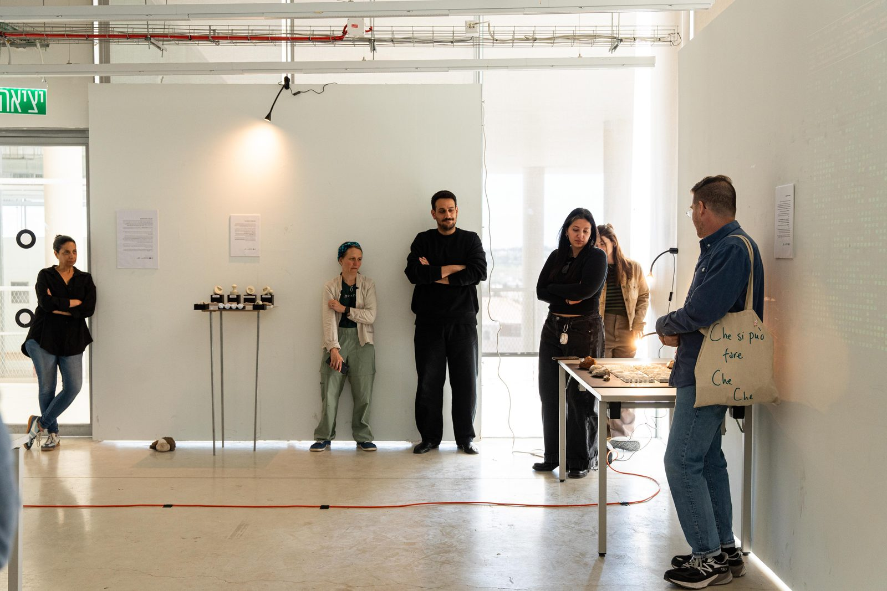
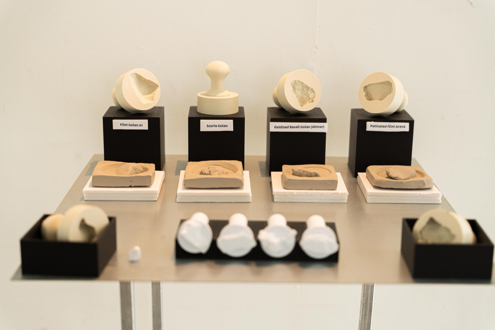
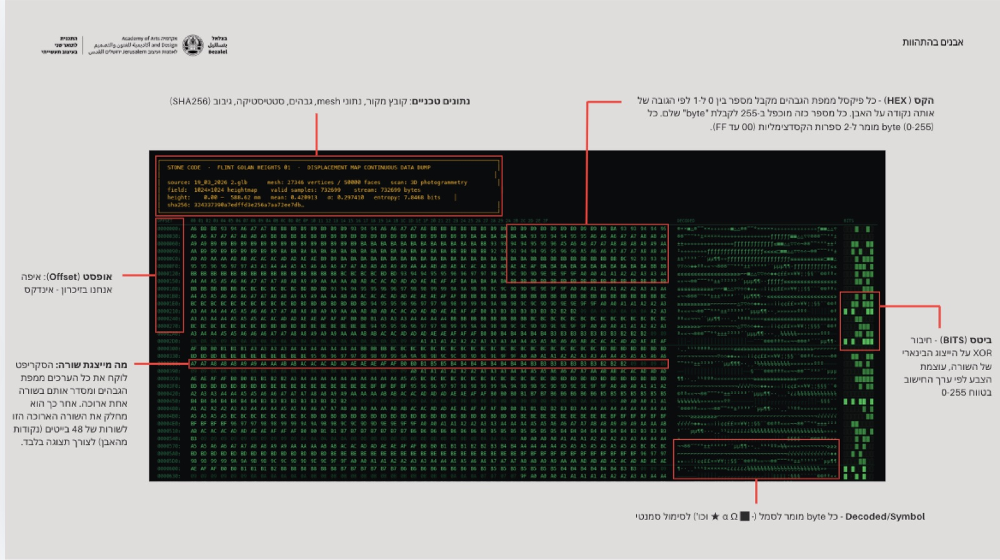
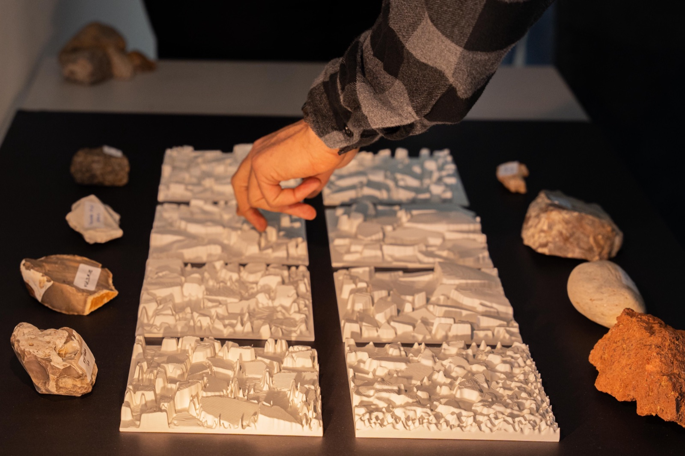
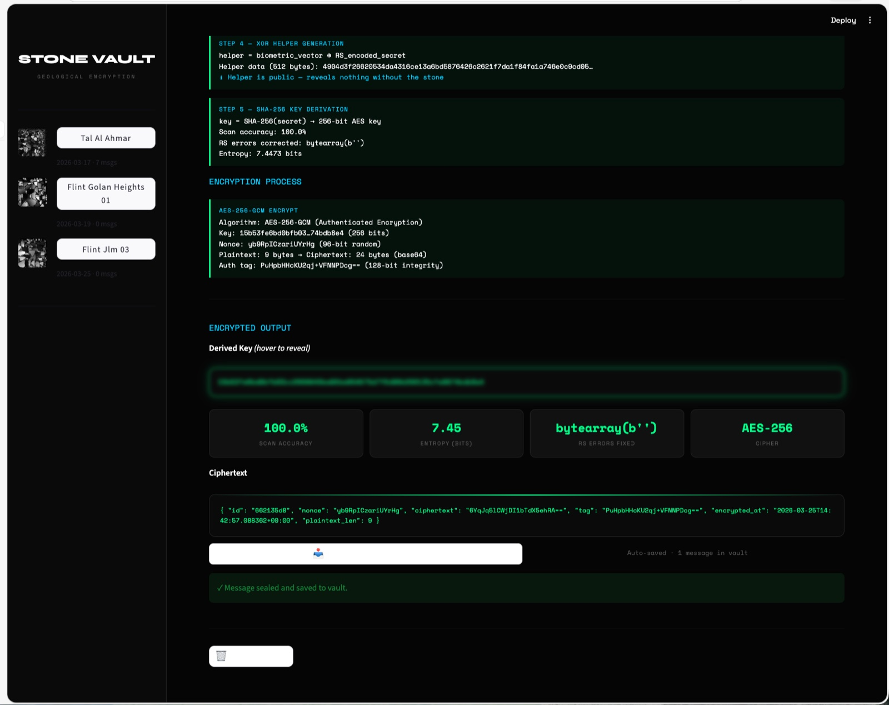
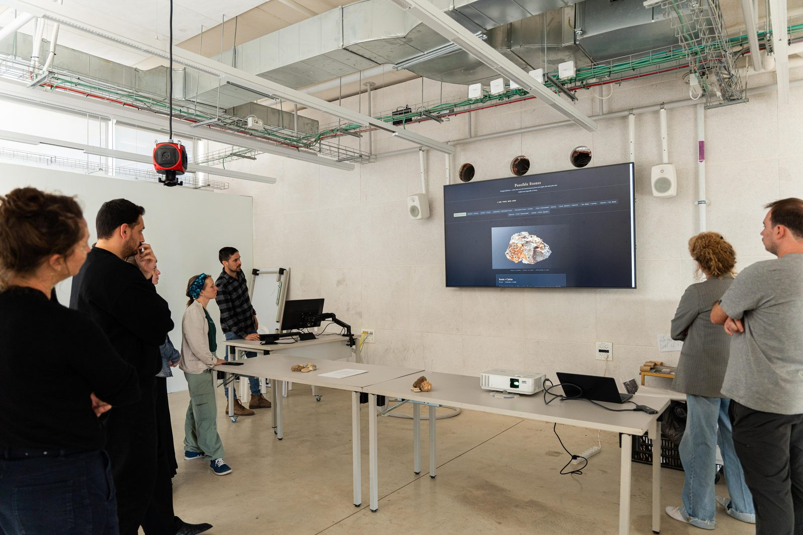

# Speaking Matter · דומם מדבר

## Navigate the Exhibition

👉 **[Visit the portal](https://maayanmag.github.io/speaking-matter/)** — available in English and Hebrew

---

## Stone as Data, Data as Stone

When a hand grasps an ancient stone and presses it into soft clay, it repeats a gesture older than writing itself. But what happens when that gesture becomes digital? When a rock's three-dimensional surface is scanned, encrypted, rendered in hexadecimal, and transformed into a cryptographic key?

*Speaking Matter* is an exhibition exploring the space between geology and mathematics — between the mute testimony of stone and the language of code. A physical installation and its digital twin, asking: what does it mean to give voice to matter that has been silent for millions of years?

---

## Four Stations: A Journey from Matter to Data

### **Touch: The Stamp and the Impression**

When a stone is scanned in three dimensions and reprinted as a stamp, it becomes a tool for witness. Each stone carries the geological signature of a place — the Golan's flint, the Arava's patina, the grain and fracture unique to its million-year history.

These stamps press into clay, leaving behind their topography. The ancient gesture of sealing becomes an act of data extraction — the stone's surface translated into imprint, presence made tangible.

### **Code: When Stone Speaks in Hexadecimal**

A computer does not see a stone. It sees numbers.

When the elevation map of a scanned rock is flattened into a stream of bytes and displayed as a dense hexadecimal table, the stone's surface becomes readable in a language it never meant to speak. Peaks glow bright green; valleys sink into darkness. Topography becomes visible as color. Every grain, every weathering, every accident of geological time appears as data.

The result reads like a classified document, a terminal screen, an ancient cipher decoded — but all it displays is the stone's own proof of existence.

### **Vault: Encryption Born from Geology**

Can a stone keep a secret?

The random topography of a rock surface, sculpted over millions of years, encodes a cryptographic key. By sampling the elevation map and applying error correction algorithms, each stone becomes a vault. Messages encrypted with its unique geological signature can only be unlocked by the stone itself — making geology itself the guardian of secrets.

The mute becomes the keeper of silence.

### **Fiction: Stones That Never Were**

What is a stone's identity — its form or its surface?

By swapping the textures of different stones — letting Galilee limestone wear the skin of Golan basalt, Jerusalem stone dress in coastal kurkar — we create forms that could have existed but never did. Algorithmic distortion stretches and warps the borrowed surface until texture and geometry become inseparable.

These *Possible Stones* are geological fictions: hybrid forms carrying the visual memory of two places, existing only in the space between them.

---

## Physical Installation & Digital Portal

This project exists in two forms:

**The Physical Exhibition** — a site-specific installation where visitors engage directly with tactile materials: stones to hold, seals to press, encrypting devices to use. The experience is embodied, temporal, ephemeral.

**The Digital Portal** — a web-based twin where the exhibition lives permanently online. Fully bilingual (Hebrew / English), it preserves the concept while translating the experience into digital form. Visitors scroll through the stations, interact with 3D stone renders, and engage with the encryption concepts through the browser.

Together, they pose a single question: can ancient matter and digital abstraction speak to each other?

---

## About the Digital Craftsmanship

The portal is built with vanilla JavaScript and Three.js for 3D rendering, deployed as a static site to allow direct access from anywhere. The bilingual interface respects right-to-left typography for Hebrew and includes accessibility features for reduced motion. No heavy dependencies; no build step — just clean code and open web standards.

---

## Credits & Context

- **Concept, design, fabrication, curation**: Maayan Magenheim
- **Installation photography**: Inbar Zak, Omer Devora  
- **Institution**: Bezalel Academy of Arts and Design, M.Des Industrial Design, 2026

*Speaking Matter* was created as a thesis project in the MA Industrial Design program, exploring the intersection of material culture, data science, and poetic technology. The work examines how digital tools can honor rather than erase the complexity of physical materials.

---

## License

All rights reserved. The concept, photographs, and exhibition materials are © Maayan Magenheim and the photographers. Code is available for reference and study.
